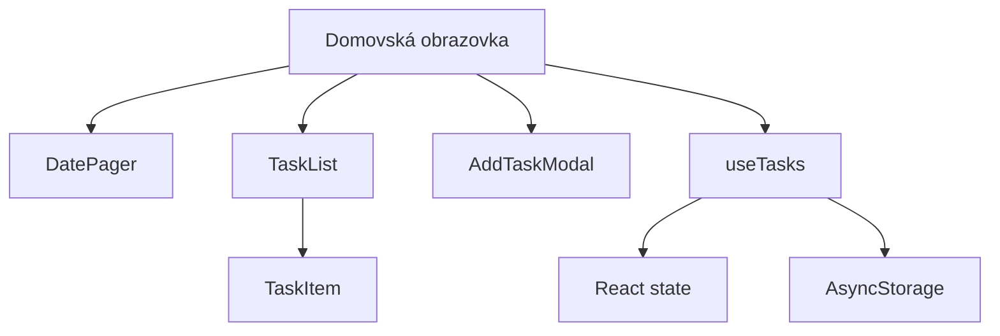
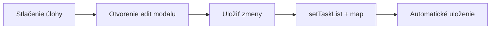
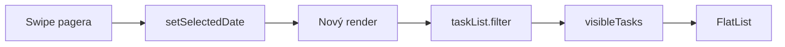
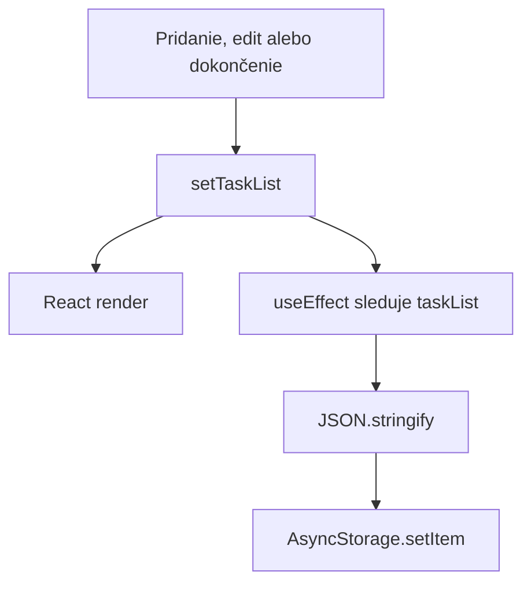
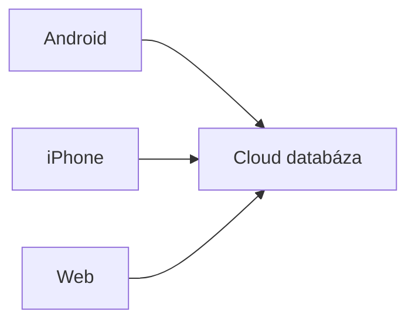

# Pocketday — plán vývoja

Tento dokument je živý plán aplikácie Pocketday. Neznamená to, že musíme implementovať všetko. Slúži ako zoznam možností, technických tém a odporúčané poradie práce.

## Vízia

Pocketday má byť jednoduchá mobilná todo aplikácia pre Android a iOS, ktorá funguje spoľahlivo aj úplne lokálne bez účtu a internetu.

Hlavné princípy:

- rýchle pridanie úlohy,
- jasné rozdelenie úloh podľa dní,
- minimum rušivých prvkov,
- plná použiteľnosť offline,
- rovnaká logika na Androide aj iOS,
- postupne rozširovateľná architektúra.

## Aktuálny stav

- [x] Expo projekt pre Android a iOS
- [x] TypeScript
- [x] domovská obrazovka
- [x] zoznam úloh cez `TaskList` a `react-native-sortables`
- [x] pridanie úlohy cez modal
- [x] názov a popis úlohy
- [x] označenie úlohy ako dokončenej
- [x] odstránenie úlohy
- [x] lokálne uloženie cez AsyncStorage
- [x] dátumový pager so swipe medzi dňami
- [x] filtrovanie úloh podľa vybraného dňa
- [x] výber dátumu pri vytváraní úlohy
- [x] základné rozdelenie typov, utility funkcií a štýlov
- [x] potvrdenie pred odstránením úlohy
- [x] úprava existujúcej úlohy
- [x] manuálna zmena poradia úloh vertikálnym dragom
- [x] uloženie poradia úloh do AsyncStorage
- [x] presun úlohy na predchádzajúci alebo nasledujúci deň horizontálnym dragom
- [x] vizuálne cieľové zóny pri presune medzi dňami
- [x] swipe doprava na dokončenie úlohy
- [x] swipe doľava na odstránenie nedokončenej úlohy
- [x] swipe doľava na obnovenie dokončenej úlohy
- [x] prázdny stav pre deň bez úloh
- [x] light a dark téma
- [x] predvolená téma podľa systémového nastavenia pri spustení
- [x] tlačidlo na návrat na dnešný deň
- [x] správne skloňovanie počtu úloh
- [x] zobrazenie počtu dokončených úloh pre vybraný deň
- [x] zvýraznenie dnešného dňa v dátumovom pageri
- [x] vizuálne stlmenie minulých a budúcich dní
- [x] otvorenie kalendára kliknutím na dátumovú kartu
- [x] výber konkrétneho dňa cez natívny Android/iOS DateTimePicker
- [x] skrytý navigačný header Expo Routera
- [x] podpora Gesture Handlera v koreňovom layoute

### Aktuálne rozpracované detaily

- [ ] pri dokončenej úlohe zmeniť text pod ľavým swipe z „Odstrániť“ na „Vrátiť“
- [ ] rozhodnúť, či sa má aplikácia prepnúť okamžite aj pri zmene systémovej témy počas behu
- [ ] doladiť vzhľad a citlivosť cieľových zón pri presune medzi dňami
- [ ] otestovať kombináciu swipe a drag gest na väčšom počte úloh
- [ ] zmeniť nadpis „Dnešné úlohy“ podľa aktuálne vybraného dňa
- [ ] rozhodnúť, či kalendár zostane obmedzený na ±30 dní alebo bude dynamický

## Navrhovaná architektúra

```text
app/
  index.tsx

components/
  add-task-modal.tsx
  date-pager.tsx
  task-item.tsx
  task-list.tsx

hooks/
  use-tasks.ts

constants/
  storage.ts
  theme.ts

types/
  task.ts

utils/
  date.ts
  task.ts

styles/
  home.styles.ts

docs/
  POCKETDAY_ROADMAP.md
```



## Priorita 1 — dokončenie základného workflow

- [x] presúvať úlohy v liste
- [x] prázdny stav pre deň bez úloh
- [x] správne skloňovanie: `1 úloha`, `2 úlohy`, `5 úloh`
- [x] zobrazenie počtu dokončených úloh
- [ ] tlačidlo „Vymazať dokončené“
- [x] možnosť presunúť úlohu na predchádzajúci alebo nasledujúci deň
- [ ] výber ľubovoľného cieľového dňa pri presune úlohy
- [x] interný stav načítania storage cez `tasksLoaded`
- [ ] viditeľný loading stav pred dokončením čítania storage
- [ ] zrozumiteľné chybové hlásenia používateľovi

### Editovanie úlohy

Pri stlačení úlohy sa otvorí rovnaký modal ako pri pridávaní, ale vyplnený existujúcimi hodnotami.



## Priorita 2 — kalendár

- [x] zvýraznenie dnešného dňa priamo v dátumovom pageri
- [x] tlačidlo na rýchly návrat na dnešný deň
- [x] vizuálne rozlíšenie minulých a budúcich dní
- [ ] bodka pri dni, ktorý obsahuje úlohy
- [ ] označenie omeškaných úloh
- [x] otvorenie kalendára kliknutím na dátumovú kartu
- [x] výber konkrétneho dňa v aktuálnom rozsahu ±30 dní
- [x] natívny mesačný výber dátumu cez DateTimePicker
- [ ] vlastný plnohodnotný mesačný kalendár s indikátormi úloh
- [ ] výber mesiaca a roka
- [ ] týždenný prehľad
- [ ] filtrovanie podľa dňa, týždňa a mesiaca
- [ ] animovaný prechod medzi dňami
- [ ] rozhodnutie, či povolíme úlohy v minulosti
- [ ] dynamické generovanie dní mimo aktuálneho rozsahu ±30 dní
- [ ] dynamický názov sekcie podľa vybraného dňa

### Aktuálny tok dátumu



## Priorita 3 — organizácia úloh

- [ ] priorita: nízka, stredná, vysoká
- [ ] kategórie: osobné, práca, zdravie a vlastné kategórie
- [ ] farebné označenie kategórií
- [ ] čas dokončenia
- [ ] zoradenie podľa času
- [ ] zoradenie podľa priority
- [x] manuálne radenie úloh
- [ ] vyhľadávanie
- [ ] filtre: všetky, aktívne, dokončené, omeškané
- [ ] poznámky s viacerými riadkami
- [ ] subtasks/checklist v jednej úlohe
- [ ] tagy
- [ ] pripnutie dôležitej úlohy

Možný budúci typ:

```ts
type Task = {
  id: number;
  title: string;
  detail: string;
  done: boolean;
  dueDate: string;
  dueTime?: string;
  priority: "low" | "medium" | "high";
  categoryId?: string;
  createdAt: string;
  completedAt?: string;
};
```

## Priorita 4 — upozornenia

- [ ] lokálna notifikácia v čase úlohy
- [ ] pripomenutie 5, 15, 30 alebo 60 minút vopred
- [ ] zrušenie naplánovanej notifikácie pri odstránení úlohy
- [ ] preplánovanie notifikácie pri editovaní
- [ ] kontrola systémového povolenia notifikácií
- [ ] zobrazenie stavu povolenia v nastaveniach

Poznámka: notifikácie budú jeden z dôvodov prechodu z Expo Go na vlastný development build.

## Priorita 5 — opakované úlohy

- [ ] každý deň
- [ ] pracovné dni
- [ ] konkrétne dni v týždni
- [ ] každý týždeň
- [ ] každý mesiac
- [ ] vlastný interval
- [ ] dátum ukončenia opakovania
- [ ] dokončenie iba jedného výskytu
- [ ] úprava jedného alebo všetkých výskytov

Pred implementáciou treba navrhnúť dátový model. Opakovanú úlohu nemusíme ukladať ako stovky samostatných záznamov; môžeme ukladať pravidlo a výskyty vypočítavať.

## Priorita 6 — dizajn a používateľský zážitok

- [x] dark mode
- [x] light mode
- [x] výber predvolenej témy podľa systému pri spustení
- [x] centrálna farebná téma v `constants/theme.ts`
- [ ] režim témy `system | light | dark` s uložením voľby
- [ ] ikony namiesto dočasných textových symbolov
- [ ] animácia pridania a odstránenia
- [ ] haptická odozva
- [x] swipe gesto na dokončenie úlohy
- [x] swipe gesto na odstránenie nedokončenej úlohy
- [x] swipe gesto na obnovenie dokončenej úlohy
- [x] vizuálna nápoveda pri dragu medzi dňami
- [ ] skeleton alebo loading indikátor
- [x] základný empty state
- [ ] ilustrovaný alebo interaktívnejší empty state
- [ ] klávesnica nesmie zakrývať modal
- [ ] automatické zameranie správneho inputu
- [ ] validácia prázdneho názvu
- [ ] vizuálne upozornenie na chybu
- [ ] splash screen a vlastná ikona aplikácie

## Priorita 7 — prístupnosť

- [ ] `accessibilityLabel` pre všetky ikonové tlačidlá (časť už doplnená)
- [ ] dostatočne veľké dotykové plochy
- [ ] dostatočný farebný kontrast
- [ ] podpora väčšieho systémového textu
- [ ] logické poradie pre VoiceOver a TalkBack
- [x] stav checkboxu oznámený čítačke obrazovky
- [ ] nepoužívať iba farbu na oznámenie stavu

## Priorita 8 — spoľahlivosť dát

- [ ] validácia dát načítaných zo storage
- [ ] verzia storage schémy
- [x] základná migrácia chýbajúceho poľa `order`
- [ ] všeobecný systém migrácií pri ďalších zmenách typu `Task`
- [ ] ochrana pred poškodeným JSON
- [ ] export úloh do JSON
- [ ] import úloh zo zálohy
- [ ] tlačidlo na vymazanie všetkých lokálnych dát
- [ ] vysvetlenie, že odinštalovanie aplikácie odstráni lokálne údaje

### Tok lokálneho uloženia



## Priorita 9 — refaktor kódu

- [ ] presunúť storage a task operácie do `useTasks`
- [x] vytvoriť `TaskItem`
- [x] vytvoriť `TaskList`
- [ ] vytvoriť `DatePager`
- [ ] vytvoriť `AddTaskModal`
- [ ] oddeliť screen štýly od komponentových štýlov
- [ ] odstrániť nepoužívané štýly a importy
- [ ] pomenovať súbory jednotným spôsobom
- [ ] zjednotiť slovenské a anglické názvy v kóde
- [x] vytvoriť centrálnu tému farieb
- [ ] vytvoriť centrálny systém spacingu

Cieľ: `app/index.tsx` má skladať obrazovku, nie obsahovať všetku aplikačnú logiku.

## Priorita 10 — testovanie

- [ ] test `toDateKey`
- [ ] test `dateKeyToDate`
- [ ] test filtrovania úloh podľa dňa
- [ ] test pridania úlohy
- [ ] test editovania
- [ ] test odstránenia
- [ ] test storage migrácie
- [ ] manuálny test na Android telefóne
- [ ] manuálny test na iPhone
- [ ] test malého aj veľkého displeja
- [ ] test dark mode
- [ ] test bez internetového pripojenia

## Voliteľná cloudová verzia

Cloud nie je potrebný pre základnú aplikáciu. Pridal by sa iba vtedy, ak budeme chcieť:

- rovnaké úlohy na viacerých zariadeniach,
- obnovu dát po strate telefónu,
- webovú verziu s rovnakými dátami,
- zdieľané úlohy,
- spoluprácu viacerých používateľov.

Možnosti do budúcnosti:

- Supabase,
- Firebase,
- vlastné API a databáza.



Bez cloudu má každé zariadenie vlastné nezávislé lokálne dáta.

## Android a iOS

Aktuálny React Native/Expo kód je spoločný pre obe platformy. Použité časti sú multiplatformové:

- React state,
- `FlatList`, `Modal`, `Pressable` a `TextInput`,
- AsyncStorage,
- SafeAreaView,
- DateTimePicker.

Treba samostatne otestovať najmä:

- vzhľad DateTimePickeru,
- správanie klávesnice,
- bezpečné okraje obrazovky,
- veľkosť modalu,
- swipe gestá,
- systémový dark mode.

Expo SDK 54 podporuje iOS 15.1 a novší.

## Definícia prvej použiteľnej verzie

Prvá verzia bude pripravená na každodenné osobné používanie, keď bude obsahovať:

- [x] stabilné pridanie, editovanie a odstránenie
- [x] dátum úlohy
- [ ] čas úlohy
- [x] lokálne uloženie
- [x] prázdny stav
- [ ] viditeľný loading stav
- [x] návrat na dnešok
- [ ] základné notifikácie
- [x] potvrdenie deštruktívnych akcií
- [ ] test na reálnom Androide a iPhone
- [ ] vlastnú ikonu a názov
- [ ] development build mimo Expo Go

## Rozhodnutia

Sem budeme zapisovať dôležité rozhodnutia, aby sme neskôr vedeli, prečo sme niečo navrhli určitým spôsobom.

| Dátum | Rozhodnutie | Dôvod |
|---|---|---|
| 2026-08-07 | Úlohy sa najprv ukladajú lokálne | Jednoduchší vývoj, offline fungovanie, bez účtov |
| 2026-08-07 | Dátum sa ukladá ako `YYYY-MM-DD` | Jednoduché porovnanie a filtrovanie podľa lokálneho dňa |
| 2026-08-07 | `visibleTasks` je odvodená hodnota | Netreba udržiavať duplicitný React state |
| 2026-08-10 | Na radenie sa používa `react-native-sortables` | Pôvodná drag knižnica spôsobovala prebliknutie položiek a dočasné blokovanie interakcie |
| 2026-08-10 | Swipe a drag majú oddelené dotykové oblasti | Obsah karty obsluhuje swipe, spodný handle obsluhuje zmenu poradia a presun medzi dňami |
| 2026-08-10 | Horizontálny drag presúva úlohu o jeden deň | Ľavá a pravá cieľová zóna dávajú používateľovi vizuálnu spätnú väzbu |
| 2026-08-10 | Téma sa pri štarte odvodí zo systému | Aplikácia rešpektuje light/dark nastavenie zariadenia a stále umožňuje ručné prepnutie |
| 2026-08-10 | Počet úloh sa skloňuje podľa slovenčiny | Rozhranie zobrazuje `1 úloha`, `2–4 úlohy` a ostatné počty ako `úloh` |
| 2026-08-10 | Kalendár používa natívny DateTimePicker | Android aj iOS dostanú prirodzené systémové ovládanie bez ďalšej knižnice |
| 2026-08-10 | Výber dátumu je zatiaľ obmedzený na ±30 dní | Dátumový pager momentálne generuje pevné pole 61 dní |

## Ďalší krok

Konkrétnu ďalšiu funkciu vyberie vlastník projektu. Odporúčané najbližšie možnosti:

1. dokončiť dynamický text „Vrátiť“ pri swipe dokončenej úlohy,
2. meniť nadpis sekcie podľa vybraného dňa namiesto stáleho „Dnešné úlohy“,
3. pridať do kalendára alebo pagera indikátor dní, ktoré obsahujú úlohy,
4. rozhodnúť o rozsahu kalendára a prípadne generovať dni dynamicky,
5. oddeliť dátumový pager a modaly z `app/index.tsx` do komponentov,
6. presunúť task/storage logiku do `useTasks`,
7. pridať čas úlohy a následne lokálne upozornenia,
8. pridať export a import lokálnej zálohy.
