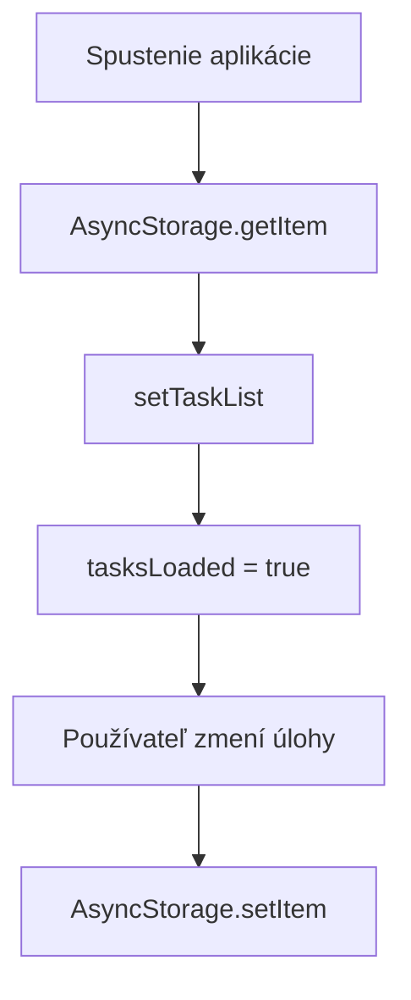
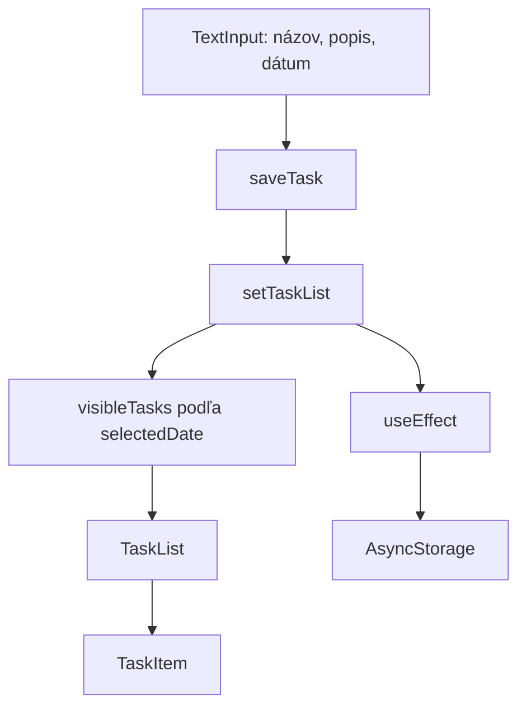

# React Native a Expo — praktický manuál podľa Pocketday

> Tento dokument je kuchárka, nie encyklopédia. Začni otázkou **„Čo chcem vytvoriť?“**, nájdi príslušný vzor a potom si prečítaj vysvetlenie pod ním.

## Obsah

1. [Ako premýšľať nad React aplikáciou](#1-ako-premýšľať-nad-react-aplikáciou)
2. [Rýchla kuchárka: chcem vytvoriť…](#2-rýchla-kuchárka-chcem-vytvoriť)
3. [Komponenty a JSX](#3-komponenty-a-jsx)
4. [Premenné, state a odvodené hodnoty](#4-premenné-state-a-odvodené-hodnoty)
5. [Props a komunikácia medzi komponentmi](#5-props-a-komunikácia-medzi-komponentmi)
6. [Zoznamy a operácie s položkami](#6-zoznamy-a-operácie-s-položkami)
7. [Formuláre a modaly](#7-formuláre-a-modaly)
8. [Efekty a AsyncStorage](#8-efekty-a-asyncstorage)
9. [Dátumy a kalendár](#9-dátumy-a-kalendár)
10. [Štýly, témy a responzívny dizajn](#10-štýly-témy-a-responzívny-dizajn)
11. [Gestá, animácie a drag](#11-gestá-animácie-a-drag)
12. [TypeScript](#12-typescript)
13. [Najčastejšie chyby](#13-najčastejšie-chyby)
14. [Slovník pojmov](#14-slovník-pojmov)
15. [Mapa Pocketday](#15-mapa-pocketday)

---

## 1. Ako premýšľať nad React aplikáciou

React obrazovku si predstav ako výsledok dát:

```text
state (dáta) → render → obrazovka
       ↑                    |
       └──── akcia usera ───┘
```

Príklad:

```text
taskList obsahuje 3 úlohy
→ React vykreslí 3 TaskItem komponenty
→ používateľ dokončí jednu úlohu
→ setTaskList vytvorí aktualizovaný zoznam
→ React znova vykreslí obrazovku
```

Základné pravidlo:

- **dáta** patria do premenných alebo state,
- **vzhľad** opisuje JSX,
- **reakcie na používateľa** patria do funkcií,
- **opakované bloky UI** patria do komponentov,
- **vzhľad komponentov** patrí do štýlov.

---

## 2. Rýchla kuchárka: chcem vytvoriť…

### Chcem zobraziť text

```tsx
<Text>Ahoj</Text>
```

V React Native nepíšeme obyčajný text priamo do `View`. Text musí byť vo vnútri `<Text>`.

### Chcem vytvoriť kontajner alebo sekciu

```tsx
<View style={styles.section}>
  <Text>Obsah sekcie</Text>
</View>
```

`View` je približne ekvivalent HTML `div`.

### Chcem vytvoriť tlačidlo

```tsx
<Pressable
  style={styles.button}
  onPress={handlePress}
>
  <Text style={styles.buttonText}>Uložiť</Text>
</Pressable>
```

```tsx
function handlePress() {
  console.log("Tlačidlo bolo stlačené");
}
```

Funkciu odovzdávame bez zátvoriek:

```tsx
onPress={handlePress}   // správne
onPress={handlePress()} // zlé: spustí sa už pri renderi
```

Ak potrebujeme poslať parameter, použijeme krátku funkciu:

```tsx
onPress={() => deleteTask(task.id)}
```

### Chcem vytvoriť textový input

```tsx
const [title, setTitle] = useState("");

<TextInput
  value={title}
  onChangeText={setTitle}
  placeholder="Názov úlohy"
/>
```

`value` určuje, čo input zobrazuje. `onChangeText` aktualizuje state pri písaní.

### Chcem vytvoriť jednu položku

```tsx
type ItemProps = {
  title: string;
};

function Item({ title }: ItemProps) {
  return (
    <View>
      <Text>{title}</Text>
    </View>
  );
}
```

Použitie:

```tsx
<Item title="Kúpiť mlieko" />
```

### Chcem vytvoriť zoznam

Pre jednoduchý zoznam:

```tsx
{items.map((item) => (
  <Item
    key={item.id}
    title={item.title}
  />
))}
```

Pre dlhý optimalizovaný zoznam:

```tsx
<FlatList
  data={items}
  keyExtractor={(item) => item.id.toString()}
  renderItem={({ item }) => (
    <Item title={item.title} />
  )}
/>
```

### Chcem pridať nový objekt do zoznamu

```tsx
const newTask = {
  id: Date.now(),
  title: "Nová úloha",
  done: false,
};

setTasks((currentTasks) => [
  ...currentTasks,
  newTask,
]);
```

`...currentTasks` skopíruje staré položky a za ne pridáme novú.

### Chcem upraviť jednu položku

```tsx
setTasks((currentTasks) =>
  currentTasks.map((task) =>
    task.id === editedId
      ? { ...task, title: newTitle }
      : task
  )
);
```

`map` prejde všetky položky. Zmení iba tú, ktorej `id` sa zhoduje.

### Chcem prepnúť boolean hodnotu

```tsx
setTasks((currentTasks) =>
  currentTasks.map((task) =>
    task.id === id
      ? { ...task, done: !task.done }
      : task
  )
);
```

`!false` je `true` a `!true` je `false`.

### Chcem odstrániť položku

```tsx
setTasks((currentTasks) =>
  currentTasks.filter((task) => task.id !== id)
);
```

`filter` ponechá iba položky, ktoré spĺňajú podmienku.

### Chcem zobraziť obsah iba niekedy

```tsx
{task.done && (
  <Text>Hotovo</Text>
)}
```

Alebo dve alternatívy:

```tsx
{task.done ? (
  <Text>Dokončená</Text>
) : (
  <Text>Aktívna</Text>
)}
```

### Chcem otvoriť a zavrieť modal

```tsx
const [modalVisible, setModalVisible] = useState(false);

<Pressable onPress={() => setModalVisible(true)}>
  <Text>Otvoriť</Text>
</Pressable>

<Modal visible={modalVisible} transparent>
  <View>
    <Pressable onPress={() => setModalVisible(false)}>
      <Text>Zavrieť</Text>
    </Pressable>
  </View>
</Modal>
```

### Chcem niečo uložiť lokálne

```tsx
await AsyncStorage.setItem(
  "@moja-app/tasks",
  JSON.stringify(tasks)
);
```

### Chcem lokálne dáta načítať

```tsx
const storedValue = await AsyncStorage.getItem(
  "@moja-app/tasks"
);

if (storedValue) {
  const parsedTasks = JSON.parse(storedValue);
  setTasks(parsedTasks);
}
```

### Chcem filtrovať položky

```tsx
const completedTasks = tasks.filter(
  (task) => task.done
);
```

Podľa dátumu:

```tsx
const visibleTasks = tasks.filter(
  (task) => task.dueDate === selectedDate
);
```

### Chcem spočítať položky

```tsx
const count = tasks.length;
```

Počet dokončených:

```tsx
const completedCount = tasks.filter(
  (task) => task.done
).length;
```

### Chcem reagovať na zmenu hodnoty

```tsx
useEffect(() => {
  console.log("Zoznam sa zmenil");
}, [tasks]);
```

Efekt sa spustí po zmene `tasks`.

---

## 3. Komponenty a JSX

Komponent je funkcia, ktorá vracia UI:

```tsx
export function Greeting() {
  return (
    <View>
      <Text>Ahoj</Text>
    </View>
  );
}
```

Názov komponentu začína veľkým písmenom. `greeting` by React považoval za iný typ elementu, ale `Greeting` rozpozná ako vlastný komponent.

JSX vyzerá ako HTML, ale je to TypeScript/JavaScript zápis UI:

```tsx
<Text style={styles.title}>
  {task.title}
</Text>
```

- text medzi tagmi je statický,
- obsah v `{}` je JavaScript výraz,
- `style={...}` je prop,
- každý otvorený tag musí byť zatvorený.

Komponent musí vrátiť jeden koreňový element:

```tsx
return (
  <View>
    <Text>Nadpis</Text>
    <Text>Popis</Text>
  </View>
);
```

---

## 4. Premenné, state a odvodené hodnoty

### Obyčajná premenná

```tsx
const appName = "Pocketday";
```

Použi ju, keď sa hodnota počas života komponentu nemení alebo sa môže pri každom renderi znovu vypočítať.

### `useState` — hodnota, ktorej zmena má prekresliť UI

```tsx
const [modalVisible, setModalVisible] = useState(false);
```

Rozklad názvov:

- `modalVisible` — aktuálna hodnota,
- `setModalVisible` — funkcia na zmenu hodnoty,
- `false` — počiatočná hodnota.

```tsx
setModalVisible(true);
```

Po zmene state React naplánuje nový render.

### Aktualizácia podľa predchádzajúcej hodnoty

```tsx
setThemeMode((currentTheme) =>
  currentTheme === "dark" ? "light" : "dark"
);
```

Tento zápis používaj, keď nová hodnota závisí od starej.

### Odvodená hodnota

Nevytváraj ďalší state pre niečo, čo sa dá vypočítať z existujúceho state.

```tsx
const visibleTasks = taskList.filter(
  (task) => task.dueDate === selectedDate
);
```

V Pocketday je `visibleTasks` odvodená z `taskList` a `selectedDate`.

### `useMemo`

```tsx
const visibleTasks = useMemo(() => {
  return taskList
    .filter((task) => task.dueDate === selectedDate)
    .sort((a, b) => a.order - b.order);
}, [taskList, selectedDate]);
```

`useMemo` si pamätá výsledok, kým sa nezmení niektorá závislosť. Použi ho pri výpočte, ktorý nechceš opakovať pri každom nesúvisiacom renderi. Nie je potrebný pre každú jednoduchú premennú.

### `useRef`

```tsx
const listRef = useRef<FlatList<Date>>(null);
```

`ref` drží referenciu na komponent alebo hodnotu bez vyvolania renderu.

```tsx
listRef.current?.scrollToIndex({
  index: 10,
  animated: true,
});
```

`?.` znamená: zavolaj metódu iba vtedy, ak `current` nie je `null`.

---

## 5. Props a komunikácia medzi komponentmi

Props sú vstupy komponentu.

```tsx
type TaskItemProps = {
  task: Task;
  onToggle: (id: number) => void;
};
```

```tsx
export function TaskItem({
  task,
  onToggle,
}: TaskItemProps) {
  return (
    <Pressable onPress={() => onToggle(task.id)}>
      <Text>{task.title}</Text>
    </Pressable>
  );
}
```

Rodič odovzdá dáta a funkciu:

```tsx
<TaskItem
  task={task}
  onToggle={toggleTask}
/>
```

Tok komunikácie:

```mermaid
flowchart LR
    Parent["Rodič: taskList + toggleTask"] -->|props| Child["Dieťa: TaskItem"]
    Child -->|onToggle(id)| Parent
    Parent -->|nový state| Render["Nový render"]
```

Bežné pravidlo: dáta tečú nadol cez props, udalosti tečú nahor cez callback funkcie.

---

## 6. Zoznamy a operácie s položkami

### `map` — transformuj každú položku

```tsx
const titles = tasks.map((task) => task.title);
```

V JSX:

```tsx
{tasks.map((task) => (
  <TaskItem key={task.id} task={task} />
))}
```

### Prečo treba `key`

```tsx
key={task.id}
```

`key` pomáha Reactu rozpoznať, ktorá položka zostala, pribudla, zmizla alebo sa presunula. Nepoužívaj index ako key, keď sa položky môžu radiť alebo odstraňovať.

### `filter` — vyber alebo odstráň položky

Vyber dokončené:

```tsx
tasks.filter((task) => task.done);
```

Odstráň podľa ID:

```tsx
tasks.filter((task) => task.id !== deletedId);
```

### `find` — nájdi jednu položku

```tsx
const task = tasks.find(
  (task) => task.id === selectedId
);
```

Výsledok môže byť `undefined`, preto ho skontroluj:

```tsx
if (!task) {
  return;
}
```

### `sort` — zoraď položky

```tsx
const sortedTasks = [...tasks].sort(
  (a, b) => a.order - b.order
);
```

Používame `[...tasks]`, pretože `sort` mení pôvodné pole. React state by sme nemali meniť priamo.

### Nemutuj state

Nerob:

```tsx
tasks.push(newTask);
task.done = true;
```

Rob:

```tsx
setTasks((current) => [...current, newTask]);
```

```tsx
{ ...task, done: true }
```

Vytvorenie nového poľa alebo objektu umožní Reactu spoľahlivo rozpoznať zmenu.

---

## 7. Formuláre a modaly

### Riadený input

```tsx
const [description, setDescription] = useState("");

<TextInput
  value={description}
  onChangeText={setDescription}
  multiline
  textAlignVertical="top"
/>
```

State je jediný zdroj pravdy pre obsah inputu.

### Validácia

```tsx
const trimmedTitle = title.trim();

if (!trimmedTitle) {
  return;
}
```

`trim()` odstráni medzery zo začiatku a konca. Prázdny string je v podmienke `false`.

### Jeden modal pre pridanie aj editovanie

```tsx
const [editingTask, setEditingTask] =
  useState<Task | null>(null);
```

```tsx
<Text>
  {editingTask ? "Upraviť úlohu" : "Nová úloha"}
</Text>
```

- `null` znamená pridávanie,
- objekt `Task` znamená editovanie.

### Zatvorenie modalu a klávesnice

```tsx
setModalVisible(false);
Keyboard.dismiss();
```

### Potvrdenie nebezpečnej akcie

```tsx
Alert.alert(
  "Odstrániť úlohu?",
  "Táto akcia sa nedá vrátiť.",
  [
    { text: "Zrušiť", style: "cancel" },
    {
      text: "Odstrániť",
      style: "destructive",
      onPress: handleDelete,
    },
  ]
);
```

---

## 8. Efekty a AsyncStorage

### Čo je `useEffect`

Render má iba vypočítať UI. Vedľajšie činnosti patria do `useEffect`, napríklad:

- načítanie dát,
- uloženie dát,
- nastavenie systémového navigačného panelu,
- prihlásenie alebo odhlásenie event listenera.

### Spusti iba raz po otvorení obrazovky

```tsx
useEffect(() => {
  loadTasks();
}, []);
```

Prázdne `[]` znamená, že efekt nemá meniace sa závislosti.

### Spusti po zmene hodnoty

```tsx
useEffect(() => {
  saveTasks();
}, [taskList]);
```

### Async funkcia vo vnútri efektu

Samotný callback efektu nemá byť `async`. Použi vnútornú funkciu:

```tsx
useEffect(() => {
  async function loadTasks() {
    const stored = await AsyncStorage.getItem(
      TASKS_STORAGE_KEY
    );

    if (stored) {
      setTaskList(JSON.parse(stored));
    }
  }

  loadTasks();
}, []);
```

### Prečo AsyncStorage potrebuje key

Storage si predstav ako skrinku s označenými zásuvkami:

```text
"@pocketday/tasks" → uložený JSON úloh
"@pocketday/theme" → budúca uložená téma
```

Key je názov zásuvky. Pod rovnakým key hodnotu uložíš aj načítaš.

### Prečo `JSON.stringify` a `JSON.parse`

AsyncStorage ukladá text:

```tsx
const text = JSON.stringify(taskList);
await AsyncStorage.setItem(TASKS_STORAGE_KEY, text);
```

Pri načítaní text zmeníme späť na pole objektov:

```tsx
const parsedTasks: Task[] = JSON.parse(storedTasks);
```

### Prečo čakať na prvé načítanie

Ak by save efekt bežal okamžite, mohol by prázdny počiatočný zoznam prepísať uložené úlohy. Preto Pocketday používa `tasksLoaded`:

```tsx
if (!tasksLoaded) {
  return;
}
```

Tok dát:



---

## 9. Dátumy a kalendár

### Stabilný dátumový kľúč

Pocketday ukladá deň ako:

```text
2026-08-23
```

Teda `YYYY-MM-DD`. Takéto hodnoty sa jednoducho filtrujú a porovnávajú.

```tsx
const isToday = dateKey === TODAY_KEY;
const isPast = dateKey < TODAY_KEY;
const isFuture = dateKey > TODAY_KEY;
```

### Vytvorenie rozsahu dní

```tsx
const days = Array.from(
  { length: 61 },
  (_, index) => {
    const date = new Date();
    date.setDate(date.getDate() + index - 30);
    return date;
  }
);
```

Výsledkom je 30 minulých dní, dnešok a 30 budúcich dní.

### Formátovanie pre používateľa

```tsx
new Intl.DateTimeFormat("sk-SK", {
  weekday: "long",
  day: "numeric",
  month: "long",
}).format(date);
```

Dáta ukladaj v stabilnom technickom formáte, ale používateľovi ich zobrazuj lokalizovane.

### DateTimePicker podľa platformy

```tsx
{Platform.OS === "android" && (
  <DateTimePicker value={date} mode="date" />
)}
```

```tsx
{Platform.OS === "ios" && (
  <DateTimePicker
    value={date}
    mode="date"
    display="inline"
  />
)}
```

`Platform.OS` umožňuje jemne odlíšiť správanie Androidu a iOS pri spoločnom zdrojovom kóde.

---

## 10. Štýly, témy a responzívny dizajn

### Základný StyleSheet

```tsx
const styles = StyleSheet.create({
  card: {
    padding: 16,
    borderRadius: 16,
    backgroundColor: "white",
  },
});
```

Použitie:

```tsx
<View style={styles.card} />
```

### Kombinovanie štýlov

```tsx
<Text
  style={[
    styles.title,
    task.done && styles.titleDone,
  ]}
>
  {task.title}
</Text>
```

Neskorší štýl v poli má prednosť. Hodnota `false` sa ignoruje.

### Flexbox

Vertikálne usporiadanie je predvolené:

```tsx
container: {
  flexDirection: "column",
}
```

Horizontálne:

```tsx
row: {
  flexDirection: "row",
  alignItems: "center",
  justifyContent: "space-between",
}
```

- `flexDirection` určuje hlavný smer,
- `justifyContent` rozmiestňuje v hlavnom smere,
- `alignItems` zarovnáva v priečnom smere,
- `flex: 1` vyplní dostupné miesto.

### Centrálna téma

```tsx
const theme = isDark ? darkTheme : lightTheme;
```

```tsx
title: {
  color: colors.text,
}
```

Výhoda: farbu zmeníš na jednom mieste a všetky komponenty používajú rovnaký význam farby.

### Systémová téma

```tsx
const systemColorScheme = useColorScheme();

const initialMode =
  systemColorScheme === "dark" ? "dark" : "light";
```

### Rozmery obrazovky

```tsx
const { width } = useWindowDimensions();
const cardWidth = width - 48;
```

`useWindowDimensions` sa aktualizuje aj po zmene orientácie alebo veľkosti okna.

### Bezpečné okraje

```tsx
<SafeAreaView style={styles.screen}>
  {/* obsah */}
</SafeAreaView>
```

Chráni obsah pred výrezom, status barom a okrajmi zariadenia.

---

## 11. Gestá, animácie a drag

### Shared value

```tsx
const translateX = useSharedValue(0);
```

Shared value je hodnota určená pre plynulé animácie mimo bežného React render cyklu.

### Pan gesto

```tsx
const swipeGesture = Gesture.Pan()
  .activeOffsetX([-15, 15])
  .failOffsetY([-12, 12])
  .onUpdate((event) => {
    translateX.value = event.translationX;
  });
```

- `activeOffsetX` určuje, koľko treba potiahnuť horizontálne,
- `failOffsetY` zruší swipe pri výraznom vertikálnom pohybe,
- `translationX` je horizontálna vzdialenosť od začiatku gesta.

### Animovaný štýl

```tsx
const animatedStyle = useAnimatedStyle(() => ({
  transform: [
    { translateX: translateX.value },
  ],
}));
```

```tsx
<Animated.View style={[styles.card, animatedStyle]}>
  {/* obsah */}
</Animated.View>
```

### Návrat pomocou pružiny

```tsx
translateX.value = withSpring(0, {
  damping: 20,
  stiffness: 220,
});
```

### `runOnJS`

Gesture callback môže bežať na UI threade. Bežnú JavaScript/React funkciu zavoláme cez:

```tsx
runOnJS(onToggle)(task.id);
```

### Swipe hranica

```tsx
if (event.translationX >= SWIPE_THRESHOLD) {
  runOnJS(onToggle)(task.id);
}
```

Ak používateľ nepotiahne dostatočne ďaleko, akcia sa nevykoná.

### Drag handle

```tsx
<Sortable.Handle>
  <Text>☰</Text>
</Sortable.Handle>
```

V Pocketday je swipe na obsahu karty a drag na samostatnom handle. Oddelenie dotykových oblastí znižuje konflikt gest.

---

## 12. TypeScript

### Typ objektu

```tsx
export type Task = {
  id: number;
  title: string;
  detail: string;
  done: boolean;
  dueDate?: string;
  order: number;
};
```

`?` znamená, že property nemusí existovať:

```tsx
dueDate?: string;
```

### Union typ

```tsx
type ThemeMode = "light" | "dark";
```

Premenná môže obsahovať iba jednu z uvedených hodnôt.

### Objekt alebo null

```tsx
const [editingTask, setEditingTask] =
  useState<Task | null>(null);
```

### Typ funkcie v props

```tsx
onDelete: (task: Task) => void;
```

Funkcia prijíma `Task` a nič nevracia.

### Generický typ

```tsx
useState<Task[]>([]);
```

State obsahuje pole objektov typu `Task`.

### Fallback operátor `??`

```tsx
const date = task.dueDate ?? TODAY_KEY;
```

Ak `dueDate` je `null` alebo `undefined`, použije sa `TODAY_KEY`.

### Spread operátor `...`

Pole:

```tsx
[...oldTasks, newTask]
```

Objekt:

```tsx
{ ...task, done: true }
```

---

## 13. Najčastejšie chyby

### `Unexpected token, expected ","`

Často chýba `}` alebo čiarka tesne pred miestom, ktoré chyba ukazuje:

```tsx
taskCard: {
  padding: 16,
}, // túto zátvorku a čiarku treba

addTaskRow: {
  flexDirection: "row",
},
```

Parser často označí nasledujúci riadok, hoci skutočná chyba je nad ním.

### Funkcia sa spúšťa hneď

```tsx
onPress={saveTask()} // zle
onPress={saveTask}   // správne
```

### Nekonečný render

Nemeň state priamo počas renderu:

```tsx
setModalVisible(true); // nesmie byť voľne v tele komponentu
```

Musí byť vo funkcii udalosti alebo efekte s rozumnými závislosťami.

### Starý state po okamžitom `setState`

```tsx
setSelectedDate(newDate);
console.log(selectedDate);
```

`selectedDate` môže ešte ukazovať starú hodnotu. Aktualizácia state je naplánovaná, nie okamžitá.

### Zoznam sa nesprávne prekresľuje

Skontroluj stabilný `key`:

```tsx
key={task.id}
```

### Expo Go nefunguje bez servera

Pri vývoji:

```text
npx expo start → Metro posiela JavaScript → Expo Go ho spúšťa
```

Bez počítača funguje až samostatný APK/production alebo development build.

### Import existuje, ale komponent nie

Skontroluj:

- správnu cestu,
- veľké a malé písmená,
- či je použitý `export`,
- či je použitý default alebo named import.

```tsx
export function TaskItem() {}
import { TaskItem } from "./task-item";
```

---

## 14. Slovník pojmov

| Pojem | Jednoduchý význam |
|---|---|
| React Native | Tvorba natívneho mobilného UI pomocou Reactu a TypeScriptu |
| Expo | Nástroje okolo React Native na vývoj, testovanie a build aplikácie |
| Expo Go | Vývojový prehrávač projektu; počas vývoja potrebuje Metro server |
| Metro | Server, ktorý pripravuje a posiela JavaScript aplikácie |
| Component | Znovupoužiteľná funkcia vracajúca UI |
| JSX / TSX | Zápis UI priamo v TypeScripte |
| Props | Vstupy poslané z rodiča do komponentu |
| State | Dáta komponentu, ktorých zmena vyvolá render |
| Render | Výpočet toho, ako má UI aktuálne vyzerať |
| Hook | React funkcia začínajúca `use`, napr. `useState` |
| Callback | Funkcia odovzdaná inej funkcii alebo komponentu |
| Effect | Vedľajšia činnosť vykonaná po renderi |
| Async / await | Zápis práce s operáciou, na ktorú treba čakať |
| AsyncStorage | Lokálne key-value úložisko mobilnej aplikácie |
| Key | Stabilná identita položky zoznamu alebo názov storage hodnoty |
| Immutable update | Vytvorenie novej verzie poľa/objektu namiesto priamej zmeny |
| FlatList | Optimalizovaný zoznam React Native |
| Modal | Obsah zobrazený nad hlavnou obrazovkou |
| Gesture | Dotykové gesto ako swipe, pan alebo drag |
| Shared value | Hodnota Reanimated určená na plynulú animáciu |
| Worklet | Funkcia, ktorú Reanimated vie spustiť na UI threade |
| Ref | Referencia alebo hodnota, ktorá nevyvoláva render |
| Type | Pravidlo opisujúce tvar a povolené hodnoty dát |

---

## 15. Mapa Pocketday

```text
app/
  index.tsx              skladá hlavnú obrazovku a momentálne drží väčšinu logiky
  _layout.tsx            koreň navigácie a GestureHandlerRootView

components/
  task-item.tsx          jedna úloha, checkbox, swipe a drag handle
  task-list.tsx          zoznam, radenie a presun medzi dňami

constants/
  storage.ts             AsyncStorage key
  theme.ts               light/dark farby

types/
  tasks.ts               tvar objektu Task

utils/
  date.ts                dátumové kľúče, formátovanie a rozsah dní

styles/
  homestyle.ts           štýly hlavnej obrazovky

docs/
  POCKETDAY_ROADMAP.md    čo je hotové a čo ešte plánujeme
```

### Aktuálny tok úlohy



### Kontrolný postup pri tvorbe novej funkcie

Keď chceš pridať novú vlastnosť, polož si otázky:

1. **Aké dáta potrebujem?** Existujú už v `Task`, alebo treba rozšíriť typ?
2. **Je to state alebo odvodená hodnota?** Musí sa ukladať, alebo sa dá vypočítať?
3. **Kto má dáta vlastniť?** Obrazovka, zoznam alebo jedna položka?
4. **Ktorý komponent ich zobrazí?** Treba nový komponent alebo iba malý JSX blok?
5. **Ako sa zmena dostane nahor?** Cez callback prop, napr. `onDelete`?
6. **Má sa hodnota uložiť?** Ak zmení `taskList`, existujúci save efekt ju uloží.
7. **Aké stavy UI existujú?** Prázdny, loading, chyba, hotovo?
8. **Funguje dotyk aj prístupnosť?** `accessibilityLabel`, dostatočná plocha, kontrast?
9. **Funguje Android aj iOS?** Treba `Platform.OS` alebo samostatný test?

---

## Ako tento manuál používať

- Pri bežnej práci začni v kapitole **Rýchla kuchárka**.
- Keď kódu nerozumieš, otvor príslušnú podrobnú kapitolu.
- Nekopíruj veľký blok naraz. Prepíš malý úsek, vysvetli si každý riadok a otestuj ho.
- Pri novej funkcii najprv napíš jej dátový tok jednou vetou, napríklad: „Klik zmení `done`, zoznam sa prekreslí a efekt uloží nový stav.“
- Tento dokument priebežne dopĺňaj o vlastné poznámky a chyby, ktoré si už vyriešil.

